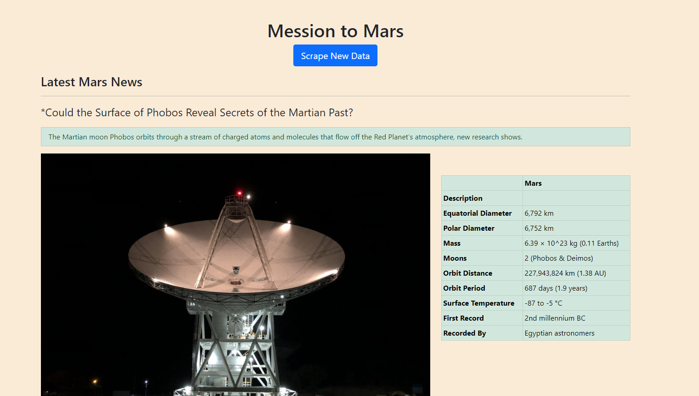

# Mission to Mars
---
* Scrape [NASA Mars News Site](https://mars.nasa.gov/news/?page=0&per_page=40&order=publish_date+desc%2Ccreated_at+desc&search=&category=19%2C165%2C184%2C204&blank_scope=Latest) and colllect the latest news title and pargraph text.

* Scrape [JPL Featured Space](https://www.jpl.nasa.gov/images/?search=&category=Mars) Image by using splinter to navigate the site.

* Scrape the table in [Mars Fact webpage](https://space-facts.com/mars/) by using Pandas then convert the data to HTML.

* Scrape [Mars Hemispheres](https://astrogeology.usgs.gov/search/results?q=hemisphere+enhanced&k1=target&v1=Mars) to obtain images foe each of Mar's hemospheres.

### Use MongoDB with Flask templating to create a new HTML page that displays all of the information that was scraped from the URLs.

* In Flask app there is two routes:
    -  a route called ` /scrape ` that will import scrape_mars.py script and call scrape function.
    - a root route` /` that will query Mongo database and pass the mars data into an HTML template to display the data.

* HTML a template called `index.html` that will take the mars data dictionary and display all of the data in the appropriate HTML elements.

And this is the final result...
    
    
    

